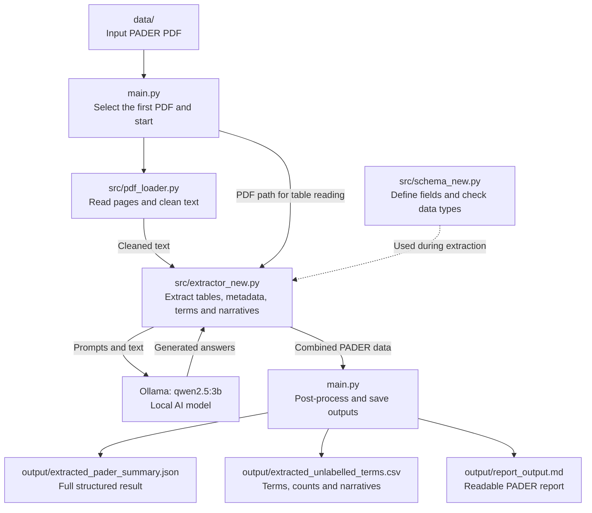

# PADER system design

**Snahanku Karar — GenAR AI Engineering Challenge**

The workflow reads a PDF, extracts its information, and saves three report files.
`main.py` coordinates the complete run.

## File-by-file flow

| Step | Folder / file | What happens |
|---|---|---|
| 1 | `data/*.pdf` | Holds the input document. |
| 2 | `main.py` | Selects the first PDF returned by the directory listing and calls `run_pipeline()`. Run from the project root. |
| 3 | `src/pdf_loader.py` | `load_pdf_text()` reads all pages with pdfplumber. `clean_extracted_text()` removes page markers and extra whitespace. Cleaned text is returned in memory. |
| 4 | `src/extractor_new.py` | `extract_pader_data()` receives the text and PDF path. It reads tables, requests metadata and terms from Ollama, then requests a narrative for each term. Prompts are inline in this file. |
| 5 | `src/schema_new.py` | Supplies the Pydantic models used during extraction: metadata, reaction totals, alert totals, terms and the combined `PADERExtraction` result. These check structure and types, not factual accuracy. |
| 6 | `main.py` | `post_process_data()` attempts placeholder-date recovery, applies count-swapping and total-recalculation rules, and removes duplicate terms. `save_outputs()` writes the results. |
| 7 | `output/` | Receives the JSON, CSV and Markdown files shown above. Each is written from the same in-memory result; JSON is not read back to create the report. Existing output files are overwritten. |

## Inside the extractor

1. **Tables:** pdfplumber reads the first three PDF pages and attempts to identify reaction and alert counts.
2. **Metadata:** Ollama receives the first 3,000 characters of cleaned text. Its structured response includes metadata and totals. Parsed table totals replace the corresponding model totals when the parsed total is greater than zero.
3. **Terms and counts:** Ollama receives text starting at the first matching case-section heading through the end of the document, or the full text if no heading matches.
4. **Narratives:** For each extracted term, Ollama receives the term name and the first 3,000 characters of that same section text.
5. **Combined result:** The extractor returns one `PADERExtraction` object to `main.py`.

## Supporting files

| File / folder | Role |
|---|---|
| `requirements.txt` | Lists Python dependencies for installation. |
| `src/__init__.py` | Marks `src` as a Python package. |
| `src/models/*.gguf` | Stored model asset. The current code calls Ollama by model name and does not directly load this file. |
| `.env` / `.env.example` | Local configuration and its example. The current pipeline does not load these files. |
| `README.md` | Project and submission guide. |
| `version1/README.md` | Proposed baseline design; not executed by the pipeline. |
| `.gitignore` / `.gitattributes` | Git exclusions and model storage through Git LFS. |

This diagram describes the current code. It does not imply that extracted values
or generated narratives have been verified against the PDF.
