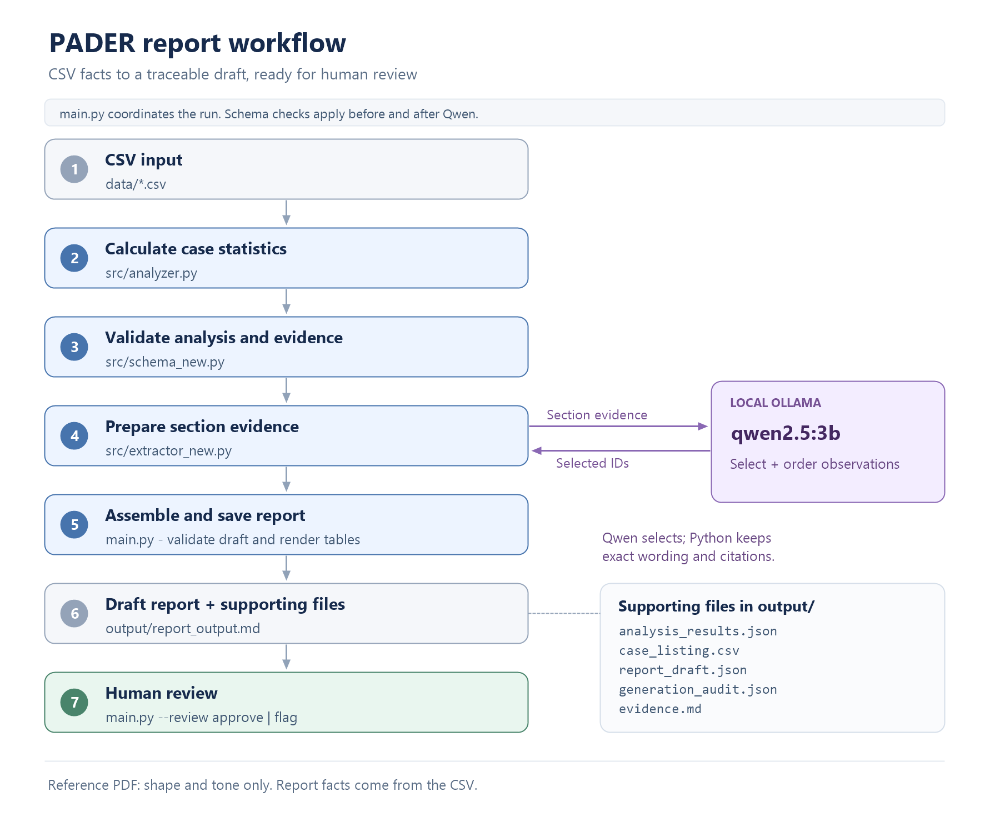
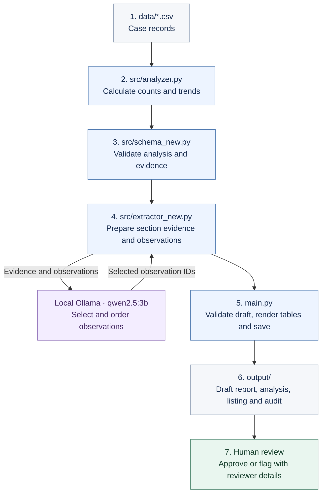

# PADER architecture

**Snahanku Karar — GenAR AI Engineering Challenge**

Run `python main.py` to turn the local case CSV into a draft report. Python
calculates the figures; local Qwen selects and orders supported observations.
A person reviews the result before recording approval.

## Simple workflow

`main.py` coordinates every step below. The reference PDF guides presentation
and tone; the running pipeline takes its facts from the CSV.

## What each file does

| Step | File or component | Responsibility |
| --- | --- | --- |
| 1 | `data/*.csv` | Provides the case records. `main.py` selects the only CSV in this folder, or uses an explicit `--input` path. |
| 2 | `src/analyzer.py` | Reads and validates CSV fields, selects the latest report versions, and calculates case totals, demographics, reactions, outcomes, expedited analyses and monthly trends. Retains case IDs and source-record references. |
| 3 | `src/schema_new.py` | Checks structure, counts, distributions, dates and supporting case references. Its report models also bind a draft to the exact analysis and validate review metadata. |
| 4 | `src/extractor_new.py` + local Qwen | Builds a compact evidence packet for each section. Qwen selects 3–5 observation IDs for each of five analytical sections. Python restores their exact wording and citations and prepares the other three sections deterministically. |
| 5 | `main.py` | Checks the completed draft, renders calculated tables and evidence links, and prepares the six output files before replacing previous results. |
| 6 | `output/` | Stores the report and its supporting evidence together. Normal generation produces a draft. |
| 7 | `main.py --review ...` | Records an explicit approve/flag decision with reviewer and timestamp, without another Qwen call. |

The schema is used throughout the run, including after generation. Analysis
objects move between Python functions in memory; the complete workflow does not
need to reread `analysis_results.json` before calling Qwen.

## Files written to output/

| File | Purpose |
| --- | --- |
| `report_output.md` | Readable report with eight sections, calculated tables and evidence links. |
| `analysis_results.json` | Complete aggregates, calculation methods, quality flags and case evidence. |
| `case_listing.csv` | Selected cases, reaction/outcome details and original CSV record references. |
| `report_draft.json` | Structured report statements, citations, analysis hash and review status. |
| `generation_audit.json` | Exact prompts, evidence packets, model settings, responses and validation attempts. |
| `evidence.md` | Clickable report references expanded into their supporting analysis values. |

The traceability chain is:

**Report statement → evidence link → analysis value → case ID → CSV record.**

## Where AI fits

Qwen handles observation selection and ordering. Python handles calculations,
statement wording, citations, tables and file writing. The model receives scoped
aggregates and prepared observations; raw CSV rows and case-ID arrays stay local
in the analysis artifacts. Both Python and Ollama run on the same machine.

Reporting dates, history-of-actions availability and the case-listing description
are deterministic sections. Missing label/SOC/action information is stated
explicitly. The reference PDF's counts and clinical narratives are not input data.

## Review and failure behavior

Open `output/report_output.md`, follow its evidence links, and inspect quality
flags and selected observations. An explicit `--review approve` or `--review flag`
records the person's decision; it does not authenticate that person or establish
clinical correctness. Regenerating the report resets its status to draft.

An invalid Qwen selection gets one corrective retry. If generation still fails,
the previous successful report stays in place. When an audit is available, the
failure is recorded separately in `output/last_generation_failure.json`.
